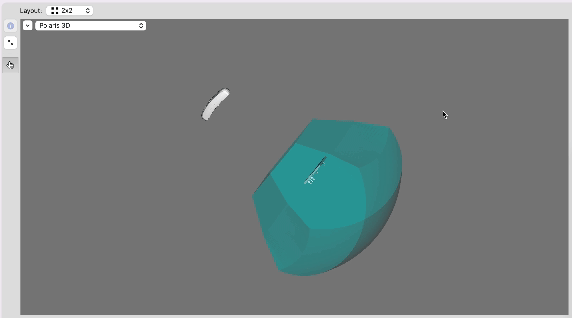

# NDI Polaris API Serial Emulator
A Python emulator for serial communication with the NDI Polaris Vega optical tracker designed for the [Brain Stimulation Engineering Lab](https://sites.google.com/view/bsel/) at Duke University. Compatible with the [NDI C API](https://github.com/PlusToolkit/ndicapi/tree/master).



## Usage (Physical Serial Connection)

Connect two ports on your machine(s) using a null modem serial cable. A successful configuration that has been tested consists:
- 2x Startech ICUSB2321F 1-Port USB to Serial RS232 Adapter Cable, connected to an iMac running Brainsight and a laptop running the emulator, respectively
- Null modem RS232 female-to-female serial cable to join the two devices

Specify the appropriate serial port for the emulator in `main.py`. Run `main.py`

Open Brainsight on the second machine and navigate to the Polaris Configuration window. Scan for all serial devices. The virtual emulator should appear with the serial number P6-00000 and status OK & Tracking. If you run into any issues, try resetting the device and scanning all serial ports again. 

Upload the ROM files of trackers you wish to use. Each tracking device is assigned a port handle (more details in the NDI Polaris Polaris Application Program Interface Guide). Use these port handles to assign pose time seris data within the emulator, simulating motion.

## Usage (Virtual Connection)
Create a virtual serial port using socat.

```
socat -d -d pty,raw,echo=1 pty,raw,echo=1
```

Set one end of the two-way virtual serial connection in `main.py`, and the other in `main.cpp` (or whatever other program you plan to use to issue commands to the serial emulator). If using the NDI C API code provided, build with CMAKE.

Run `main.py` and `./build/main`

## Future Work
- Implement full error management in accordance with NDI API
- Pipe output from MediaPipe (or another face tracking program) into BrainSight
- Package into a Python library
